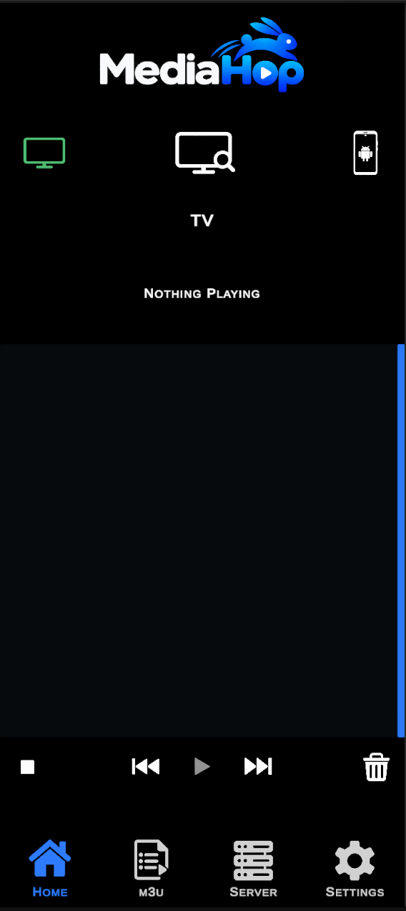
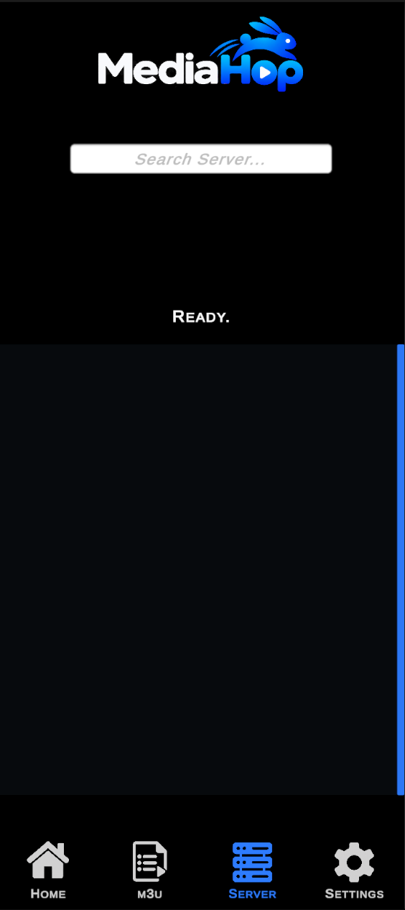
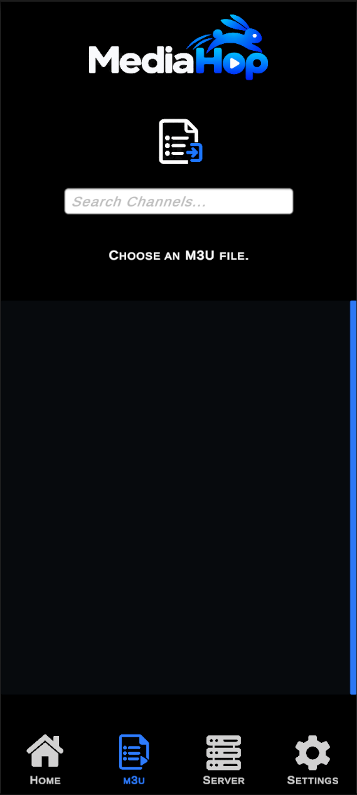
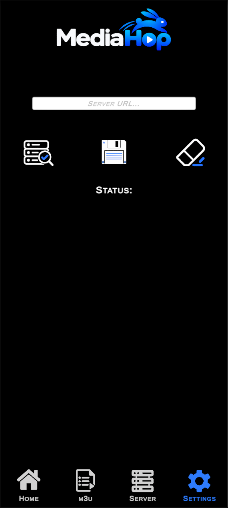

# MediaHop

MediaHop is an Android media app designed to make it easy to play media from a server or M3U playlist on either your phone or a compatible TV.

The goal is simple:

**Pick something to play, choose where you want it to play, and switch between devices without starting over.**

---

## Current Features

MediaHop currently supports:

- Browse media from a configured server
- Open and browse M3U playlists
- Play media directly on Android
- Stream media to compatible TVs using DLNA / UPnP
- Switch playback from Phone → TV
- Switch playback from TV → Phone
- Resume normal media files from the current playback position
- Playlist playback
- Previous / Next controls
- Automatic playlist progression
- Phone / TV playback target selection
- TV availability detection
- Fullscreen Android playback
- Seek and scrub controls
- 15-second skip controls
- Screen rotation support
- Multiple aspect-ratio options
- Background TV streaming
- Stop all active playback

---

## Testing

MediaHop is currently in active development and testing.

If you install a test build, I am mainly looking for feedback on:

- Playback problems
- TV discovery problems
- Phone ↔ TV switching
- M3U playlist behaviour
- Server browsing
- Crashes or freezes
- Audio or video problems
- UI problems
- Device compatibility
- Anything that behaves differently from what you expected

If something breaks, please include as much useful information as possible, such as:

- Phone model
- Android version
- TV model if relevant
- What you were trying to play
- Whether playback was on the phone or TV
- What happened
- What you expected to happen
- Whether the problem happens every time

Screenshots are also helpful when relevant.

---

## Test Builds

Test APK releases will be available through the **Releases** section of this repository.

MediaHop is not currently distributed through the Google Play Store.

Android may warn that the APK is being installed from an external source.

Only install builds downloaded directly from this official MediaHop repository.

---

## Feedback & Bug Reports

Please use the **Issues** section of this repository to report bugs, compatibility problems, or other feedback.

Before opening a new issue, check whether the same problem has already been reported.

---

## Current Status

MediaHop is still under development.

Features may change, bugs are expected, and test builds may occasionally behave differently between devices.

The purpose of these releases is to find those problems and improve the app.

---

## Screenshots

### Home

### Server Browser

### M3U Browser

### Settings

---

## Source Code

This repository is for MediaHop test releases, documentation, and feedback.

The MediaHop development source code and Unity project are maintained privately and are not included in this repository.
